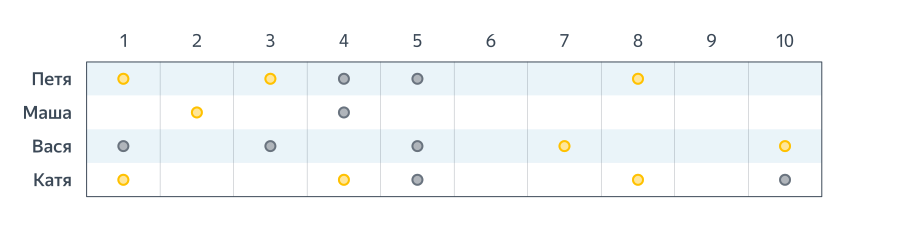

# Как создается рекомендательная система?

## Оглавление
1. [Определение бизнес-процесса](#id1)
1. [Формализация задачи](#id2)
1. [Работа с персонализированными данными](#id3)
   - [Коллаборативная фильтрация](#id3_1)
   - [Content-based рекомендации](#id3_2)

## 1. Определение бизнес-процесса <a id="id1"></a>

**Предмет рекомендации** – что рекомендуется. Здесь большое разнообразие – это могут быть товары (Amazon, Ozon), статьи (Arxiv.org), новости (Surfingbird, Яндекс.Дзен), изображения (500px), видео (YouTube, Netflix), люди (Linkedin, LonelyPlanet), музыка (Last.fm, Pandora), плейлисты и прочее. В целом, рекомендовать можно что угодно.
Цель рекомендации – зачем рекомендуется. Например: покупка, информирование, обучение, заведение контактов.

**Контекст рекомендации**  – что пользователь в этот момент делает.Например: смотрит товары, слушает музыку, общается с людьми.

**Источник рекомендации** – кто рекомендует:

– аудитория (средний рейтинг ресторана в TripAdvisor),
– схожие по интересам пользователи,
– экспертное сообщество (бывает, когда речь о сложном товаре, таком, как, например, вино).

**Степень персонализации.**

- Неперсональные рекомендации – когда вам рекомендуют то же самое, что всем остальным. Они допускают таргетинг по региону или времени, но не учитывают ваши личные предпочтения. Более продвинутый вариант – когда рекомендации используют данные из вашей текущей сессии. Вы посмотрели несколько товаров, и внизу страницы вам предлагаются похожие.
- Персональные же рекомендации используют всю доступную информацию о клиенте, в том числе историю его покупок.
  
**Прозрачность.**
Хорошая рекомендательная система сама должна уметь бороться с купленными отзывами и накрутками продавцов.
Манипуляции кстати бывают и непреднамеренными. Например, когда выходит новый блокбастер, первым делом на него идут фанаты, соответственно, первую пару месяцев рейтинг может быть сильно завышен.

**Формат рекомендации.** - это может быть всплывающее окошко, появляющийся в определенном разделе сайта отсортированный список, лента внизу экрана или что-то еще.

**Алгоритмы.** Несмотря на множество существующих алгоритмов, все они сводятся к нескольким базовым подходам, которые будут описаны далее. К наиболее классическим относятся алгоритмы Summary-based (неперсональные), Content-based (модели основанные на описании товара), Collaborative Filtering (коллаборативная фильтрация), Matrix Factorization (методы основанные на матричном разложении) и некоторые другие.

## Определение источника данных

В центре любой рекомендательной системы находится так называемая матрица предпочтений. Это матрица, по одной из осей которой отложены все клиенты сервиса (Users), а по другой – объекты рекомендации (Items). На пересечении некоторых пар (user, item) данная матрица заполнена оценками (Ratings) – это известный нам показатель заинтересованности пользователя в данном товаре, выраженный по заданной шкале (например от 1 до 5).


Пользователи обычно оценивают лишь небольшую часть товаров, что есть в каталоге, и задача рекомендательной системы – обобщить эту информацию и предсказать отношение клиента к другим товарам, про которые ничего не известно. Другими словами нужно заполнить все незаполненные ячейки на картинке выше.

Шаблоны потребления у людей разные, и не обязательно должны рекомендоваться новые товары. Можно показывать повторные позиции, например, для пополнения запаса. По этому принципу выделяют две группы товаров:

- Повторяемые. Например, шампуни или бритвенные станки, которые нужны всегда.
- Неповторямые. Например, книги или фильмы, которые редко приобретают повторно.

Если продукт нельзя явно отнести к одному из классов, имеет смысл определять допустимость повторных покупок индивидуально (кто-то ходит в магазин только ради арахисового масла определенной марки, а кому-то важно попробовать все, что есть в каталоге).

Понятие «интересности» тоже субъективное. Некоторым пользователям нужны вещи только из их любимой категории (conservative recommendations), а кто-то, наоборот, больше откликается на нестандартные товары или группы товаров (risky recommendations). Например, видеохостинг может рекомендовать пользователю только новые серии любимого сериала, а может периодически закидывать ему новые шоу или вообще новые жанры. В идеале стоит выбирать стратегию показа рекомендаций под каждого клиента отдельно, с помощью моделирования категории клиента.

Пользовательские оценки можно получить двумя способами:
- явно (explicit ratings) – пользователь сам ставит рейтинг товару, оставляет отзыв, лайкает страницу,
- неявно (implicit ratings) – пользователь явно свое отношение не выражает, но можно сделать косвенный вывод из его действий: купил товар – значит он ему нравится, долго читал описание – значит есть интерес и т.п. Он выступает в качестве прокси к явному фидбеку

Конечно, явные предпочтения лучше – пользователь сам говорит о том, что ему понравилось. Чаще всего используются сразу оба типа оценок и хорошо дополняют друг друга.

Также важно отличать термины Prediction (предсказание степени интереса) и собственно Recommendation (показ рекомендации). Что и как показывать – это отдельная задача, которая использует полученные на шаге Prediction оценки, но может быть реализована по-разному.

## 2. Формализация задачи <a id="id2"></a>

$\Large R_u = (r_ui)_{i\in\Bbb I_u}$, где U - множество юзеров, I - айтемов. Оценить значение $r_ui$ для каждого пользователя и выбрать несколько товаров с наибольшими значениями.

Задачу построения рекомендательной системы можно формулировать в качестве задачи классификации (клик/не клик) или регрессии (сколько звёзд пользователь поставит объекту), но это не самые распространённые стратегии.

**Ранжирующая модель.** 
Достаточно уметь для пользователя и набора объектов генерировать перестановку этих объектов в порядке убывания рейтинга. Модель, решающую данную задачу, называют ранжирующей.

## 3. Работа с персонализированными данными <a id="id3"></a>

### 3.1 Коллаборативная фильтрация <a id="id3_1"></a>



КФ объединяет семейство методов рекомендаций, использующих сходство по истории взаимодействия между пользователем и товаром. Рассмотрим конкретные простые методы коллаборативной фильтрации.

#### 1) User2User

``` math
\hat{r}_{ui} = \frac{\sum_{v \in N(u)} s(u, v) r_{vi}}{\sum_{v \in N(u)} \lvert s(u, v) \rvert}
```

Классическая реализация алгоритма основана на принципе k ближайших соседей. На пальцах – для каждого пользователя ищем k наиболее похожих на него (в терминах предпочтений) и дополняем информацию о пользователе известными данными по его соседям, однако есть один явный минус – он плохо применим на практике из-за квадратичной сложности. Действительно, как любой метод ближайшего соседа, он требует расчета всех попарных расстояний между пользователями (а пользователей могут быть миллионы). Нетрудно посчитать, что сложность расчета матрицы расстояний будет $O(n^2m)$, где n — число пользователей, а m — число товаров. При миллионе пользователей для хранения матрицы расстояний в сыром виде, потребуется минимум 4TB.

Данная проблема отчасти может быть решена покупкой высокопроизводительного железа. Но если подходить с умом, то лучше ввести корректировки в алгоритм:

- обновлять расстояния не при каждой покупке, а батчами (например, раз в день),
- не пересчитывать матрицу расстояний полностью, а обновлять ее инкрементально,
- сделать выбор в пользу итеративных и приближенных алгоритмов (например ALS).

Для того чтобы алгоритм был эффективен, важно чтобы выполнялось несколько допущений.

* Вкусы людей не меняются временем (или меняются, но для всех одинаково).
* Если вкусы людей совпадают, то они совпадают во всем.

Например, если два клиента предпочитают одни фильмы, то книги им тоже нравятся одинаковые. Так часто бывает, когда рекомендуемые товары однородны (например, только фильмы). Если это же не так, то у пары клиентов вполне могут совпадать предпочтения в еде, а политические взгляды быть прямо противоположными — здесь алгоритм будет менее эффективным.

**Оценка схожести пользователей:**

- взвешенное среднее
- брать не сырой рейтинг пользователя, а с учетом отклонения от среднего всех оценок пользователя 
- дополнительно учесть дисперсию оценок пользователя

``` math
\hat{r}_{ui} = \overline{r}_u + \sigma_{u} \frac{\sum_{v \in N(u)} s(u, v) \left(r_{vi} - \overline{r}_v\right) / \sigma_v}{\sum_{v \in N(u)} \lvert s(u, v) \rvert}, \, \text{где} \, \sigma_{u} = \sqrt{ \frac{1}{I_u} \sum_{i \in I_{u} } \left(r_{ui} - \overline{r}_u\right) ^ 2},
```
  
- Мера Жаккара
  $$s(u, v) = \frac{\lvert P_u \cap P_v \rvert}{\lvert P_u \cup P_v \rvert}$$
- скалярное произведение общих рейтингов $$\Large s(u,v) = \Sigma_{i\in\Bbb I_u \cap I_v} r_{ui} r_{vi} $$
- Кореляция Пирсона
- Дисконтированная корреляция Пирсона

#### 2) Item2Item

Теперь решается транспонированная задача с мерой похожести объектов $s(i,j)$.
Если нам нужно оценить рейтинг, который пользователь $u$ поставил бы ещё не виденному им объекту $i$
, то мы можем рассмотреть множество $N(i)$ близких к $i$ объектов и оценить $r_ui$  аналогично user2user подходу.

Тогда мерой схожести может быть adjusted cosine:
``` math
s(i, j) = \frac{\sum_{u \in U_i \cap U_j} (r_{ui} - \overline{r}_u)(r_{vi} - \overline{r}_v)}{\sqrt{\sum_{u \in U_i \cap U_j} (r_{ui} - \overline{r}_u)^2} \sqrt{\sum_{u \in U_i \cap U_j} (r_{vi} - \overline{r}_v)^2}}
```

### Особенности коллаборативной фильтрации

- Они не опираются ни на какую дополнительную информацию кроме матрицы оценок $R_{ui}$, предполагая, что этого должно быть достаточно для улавливания качественного сигнала о схожести пользователей и товаров;
- Предложенные методы не применимы для новых объектов и пользователей – для них просто нет истории или она недостаточно информативна для того, чтобы методы могли давать более-менее точные оценки;
- Так как методы коллаборативной фильтрации основаны только на истории прошлых взаимодействий, рекомендательная система, построенная исключительно на их основе будет постепенно вгонять пользователя в информационный пузырь: эти методы не предполагают открытия новых интересов у пользователя, они способны только эксплуатировать уже имеющиеся.


### 3.2. Content-based рекомендации <a id="id3_2"></a>


## Задача ранжирования


### Метрики качества ранжирования

#### 1. Mean average precision

Mean average precision at K (map@K) — одна из наиболее часто используемых метрик качества ранжирования. Чтобы разобраться в том, как она работает начнем с «основ».

Замечание: "*precision" метрики используется в бинарных задачах, где $r^{true}(e)$ принимает только два значения: 0 и 1.


